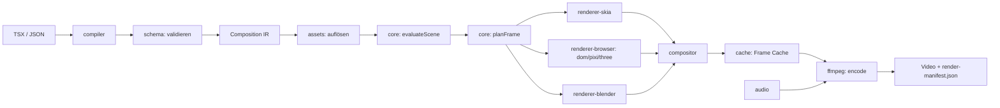
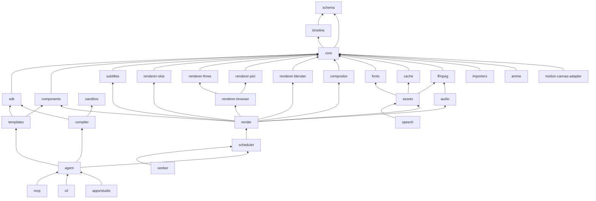
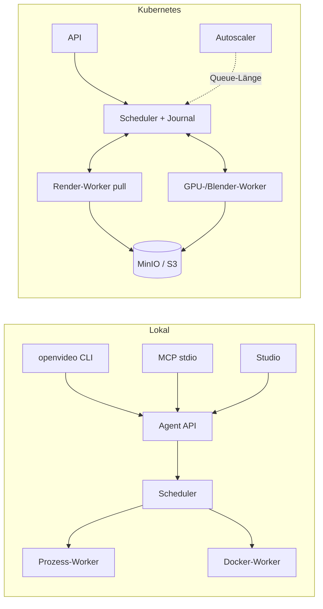

# Architecture Spine — OpenVideo

## Design-Paradigma

**Pipes-and-Filters um einen reinen, hexagonalen Kern.**

- Der Kern (`schema`, `timeline`, `core`) ist rein: keine Ein-/Ausgabe, keine Uhr, kein Zufall ohne Seed. Er läuft in Node und im Browser.
- Adapter (Renderer, Medien, Speicher, Sandbox) liegen außen und hängen vom Kern ab, nie umgekehrt.
- Der Render ist eine Pipeline aus Filtern mit festen Datenformaten zwischen den Stufen.



## Invarianten und Regeln

### AD-1 — Die Composition IR ist die einzige Wahrheit [ADOPTED]

- **Binds:** alle Pakete, FR-1..FR-5, FR-17, FR-17a, FR-76
- **Prevents:** Zweites Projektformat; Renderer-spezifische Modelle als Quelle.
- **Rule:** Jede Eingabe (TSX, JSON, Studio, Patch, Import) wird zur IR. Jeder Renderer liest nur Evaluated Scenes aus der IR. Die IR ist JSON, trägt `schemaVersion` und hat ein JSON Schema aus einer einzigen TypeBox-Definition in `schema`.

### AD-2 — Frame als reine Funktion [ADOPTED]

- **Binds:** `timeline`, `core`, alle Renderer, FR-6, FR-7, FR-9
- **Prevents:** Zustand zwischen Frames; Wall-Clock-Abhängigkeit.
- **Rule:** `evaluateScene(project, compositionId, frame, seed) → EvaluatedScene` ist rein. Renderer erhalten nur Evaluated Nodes und aufgelöste Assets. Zufall kommt nur aus `random(seed, ...schlüssel)` (zustandslos, hash-basiert). Kein Renderer hält frame-übergreifenden Zustand außer inhalts-adressierten Caches.

### AD-3 — Animierte Werte sind Daten mit `$`-Präfix

- **Binds:** `schema`, `timeline`, `sdk`, FR-10..FR-16
- **Prevents:** Kollision zwischen Objekt-Werten und Animationsbeschreibungen.
- **Rule:** Eine Property ist ein Literal oder genau eines von `{"$keyframes": …}`, `{"$spring": …}`, `{"$expr": "…"}`, `{"$sampled": …}`, `{"$ref": "theme.…"}`. Zeitwerte sind Zahl (Frames) oder String (`"2s"`, `"500ms"`, `"00:00:02:00"`, `"marker:intro+10f"`).

### AD-4 — Einheiten und Koordinaten

- **Binds:** alle Renderer, `sdk`, `components`
- **Prevents:** Grad gegen Radiant, Y-oben gegen Y-unten.
- **Rule:** 2D: Pixel, Ursprung oben links, y nach unten. Winkel immer in Grad. 3D: rechtshändig, y nach oben, Einheiten in Metern. Farben als `#RRGGBB` oder `#RRGGBBAA` (sRGB, nicht vormultipliziert).

### AD-5 — Renderer-Schnittstelle und Layer

- **Binds:** alle `renderer-*`, `compositor`, `render`, FR-31, FR-44, FR-45
- **Prevents:** Renderer, die selbst komponieren oder die IR umdeuten.
- **Rule:** Ein Renderer implementiert `RenderBackend { id, version, capabilities, check(node), renderLayer(request) }`. `renderLayer` liefert `RgbaImage` (8 Bit, vormultipliziertes Alpha, sRGB-kodiert) in Composition-Größe. `planFrame` fasst benachbarte Nodes desselben Backends zu einem Layer zusammen. Nodes vom Typ `layer`, `html`, `scene3d` und `blender` bilden immer eigene Layer.

### AD-6 — Der Compositor besitzt Farbe und Blending

- **Binds:** `compositor`, FR-46, FR-47, FR-60a, NFR-12
- **Prevents:** Renderer-abhängige Farbergebnisse.
- **Rule:** Layer-Blending, Masken, Crop, Layer-Effekte und Farbraum-Umwandlung passieren nur im Compositor (reines TypeScript). Arbeitsraum ist pro Composition `srgb` (Standard) oder `linear`. Alpha bleibt bis zum Encoder erhalten.

### AD-7 — Inhalts-Hashes als einzige Cache-Schlüssel

- **Binds:** `cache`, `assets`, `fonts`, `render`, FR-50, FR-68, FR-69
- **Prevents:** Veraltete Caches; doppelte Verarbeitung.
- **Rule:** Schlüssel = SHA-256 über kanonisches JSON (sortierte Schlüssel) plus Versionen der beteiligten Renderer. Der Frame-Schlüssel entsteht aus der Evaluated Scene des Frames. Nur Frames mit neuem Schlüssel werden gerendert.

### AD-8 — Nicht vertrauenswürdiger Code nur im Container

- **Binds:** `sandbox`, `compiler`, `worker`, `agent`, `mcp`, FR-70..FR-72
- **Prevents:** Ausführung von Agent-Code auf dem Host.
- **Rule:** TSX-Auswertung und Browser-Rendering mit Nutzer-Skripten laufen in einem Container: `--network none`, `--read-only`, `--cap-drop ALL`, `no-new-privileges`, Nutzer 65534, Limits für CPU, RAM, PIDs und Zeit, ohne Host-Mounts. Eingaben kommen über stdin, Ergebnisse über stdout. Agent API und MCP erzwingen das. `--trusted` erlaubt Host-Ausführung nur in der CLI und steht im Manifest.

### AD-9 — Eine Operationsdefinition für API, MCP und CLI

- **Binds:** `agent`, `mcp`, `cli`, FR-21..FR-23, FR-78
- **Prevents:** Abweichende Semantik zwischen Schnittstellen.
- **Rule:** Jede Operation ist einmal in `agent` definiert: Name, Eingabe-Schema, Ausgabe-Schema, Handler. HTTP-Server, MCP-Server und CLI `--json` rufen dieselbe Definition auf.

### AD-10 — Strukturierte Fehler

- **Binds:** alle Pakete, FR-4, FR-87
- **Prevents:** Rohe Fehlermeldungen wie „WebGL error 1282“.
- **Rule:** Fehler sind `OpenVideoError` mit `code`, `errorClass`, `problem`, optional `nodeId`, `frame`, `path`, `details`, `suggestions[]`. Diagnosen haben dieselbe Form plus `severity`. Kein leerer `catch`.

### AD-11 — Komponenten sind IR-Makros

- **Binds:** `components`, `templates`, `subtitles`, `sdk`, FR-81..FR-83
- **Prevents:** Komponenten, die nur in TSX existieren.
- **Rule:** Eine Komponente ist eine reine Funktion `(props, theme, ctx) → Node[]`. In der IR steht `{"type":"component","component":"BarChart","props":…}`. `evaluateScene` expandiert sie. Kind-IDs lauten `<komponenten-id>/<lokale-id>`.

### AD-12 — Plugins über ein Register mit deklarierten Capabilities

- **Binds:** `core`, alle Erweiterungen, FR-84
- **Prevents:** Globale Singletons; unkontrollierte Erweiterungen.
- **Rule:** Es gibt kein globales Register. Ein `Registry`-Objekt wird erzeugt und explizit weitergereicht. Plugins deklarieren `permissions`; das System gibt ihnen nur ein Kontextobjekt mit diesen Rechten.

### AD-13 — Browser-Renderer: eigene Origin, geblocktes Netz, virtuelle Zeit

- **Binds:** `renderer-browser`, `renderer-three`, `renderer-pixi`, FR-36, FR-37, FR-42
- **Prevents:** Nicht-deterministische Browser-Frames; Netzzugriff beim Rendern.
- **Rule:** Chromium lädt die Laufzeit von einem lokalen HTTP-Server (Voraussetzung für WebGPU). Jede andere Anfrage wird blockiert. `Date`, `performance.now`, `requestAnimationFrame` und `Math.random` sind virtualisiert. Web Animations werden pausiert und auf die Composition-Zeit gesetzt. Pixel kommen per `POST` an den lokalen Server zurück; DOM-Layer per CDP-Screenshot mit transparentem Hintergrund.

### AD-14 — Gerichtete Paketabhängigkeiten

- **Binds:** alle Pakete, NFR-1
- **Prevents:** Zyklen; Kern abhängig von Renderern.
- **Rule:** Nur die Pfeile unten sind erlaubt. `scripts/check-deps.mjs` prüft das im Build.



## Konsistenz-Konventionen

| Thema | Konvention |
| --- | --- |
| Paketnamen | `@agentic-video/<ordner>`; Produktname über `PRODUCT_NAME` in `core` |
| Module | ESM only, `"type": "module"`, `NodeNext`, Ausgabe `dist/` |
| Node-IDs | `^[a-zA-Z][a-zA-Z0-9_-]*$`, Komponenten-Kinder mit `/` |
| Node-Typen | kebab-case: `rect`, `text`, `scene3d`, `camera3d` |
| Properties | camelCase; Winkel `rotation` in Grad |
| Operationen | `bereich.verb` in camelCase: `preview.contactSheet` |
| Fehler | `OpenVideoError`, Code `OV_<BEREICH>_<NAME>` |
| Zeit | intern Frames (ganzzahlig beim Rendern, reell beim Evaluieren) |
| Hashes | `sha256:` + 64 Hex-Zeichen |
| Logging | strukturiert über `telemetry`; keine `console.log` in Bibliotheken |
| Konfiguration | explizite Optionen; Umgebungsvariablen nur in `cli`, `worker`, `agent` mit Präfix `OPENVIDEO_` |
| Kommentare, Doku | Deutsch; Bezeichner Englisch |

## Stack

| Name | Version |
| --- | --- |
| Node.js | ≥ 22.13 (lokal 22.23.3) |
| TypeScript | 6.0.3 |
| npm Workspaces | npm 10 |
| typebox | 1.3.x |
| @noble/hashes | 2.4.x |
| canvaskit-wasm | 0.42.0 |
| pixi.js | 8.21.x |
| three | 0.186.x |
| playwright / Chromium | 1.63.0 / 153 |
| esbuild | 0.28.x |
| @modelcontextprotocol/sdk | 1.30.x |
| React / Vite / Monaco | 19.3 / 8.3 / 0.57 |
| Vitest / fast-check | 5.0 / 4.10 |
| ESLint / typescript-eslint | 10.11 / 8.70 |
| OpenTelemetry API / SDK | 1.9 / 0.222 |
| FFmpeg (extern) | ≥ 6.0, lokal 7.0.2 |
| Blender (extern, optional) | ≥ 4.2 |

## Struktur-Seed

```text
agentic-video-engine/
  packages/
    schema/  timeline/  core/  sdk/  components/  templates/  compiler/
    sandbox/ fonts/  cache/  assets/  ffmpeg/  audio/  subtitles/  speech/
    renderer-skia/  renderer-browser/  renderer-three/  renderer-pixi/  renderer-blender/
    compositor/  render/  scheduler/  worker/  agent/  mcp/  cli/
    importers/  anime/  motion-canvas-adapter/  telemetry/  testing/  benchmarks/
  apps/studio/
  deploy/docker/  deploy/k8s/
  docs/adr/  docs/guide/  docs/api/
  examples/
  scripts/
```



## Capability → Architektur

| Bereich | Liegt in | Geregelt durch |
| --- | --- | --- |
| FR-1..5 IR, Schema, Migration | `schema` | AD-1, AD-3 |
| FR-6..9 Determinismus, Manifest | `core`, `render` | AD-2, AD-7 |
| FR-10..16 Timeline | `timeline` | AD-2, AD-3 |
| FR-17..18 TSX | `sdk`, `compiler` | AD-1, AD-8 |
| FR-19..20 Patches | `core` | AD-1 |
| FR-21..23 Agent API, MCP | `agent`, `mcp` | AD-9 |
| FR-24..27 Feedback | `render`, `renderer-skia`, `core` | AD-5, AD-10 |
| FR-28..35 2D, Typografie | `renderer-skia`, `renderer-pixi`, `fonts` | AD-4, AD-5 |
| FR-36..37 DOM | `renderer-browser` | AD-13 |
| FR-38..42 3D | `renderer-three` | AD-4, AD-13 |
| FR-43..44 Blender | `renderer-blender` | AD-5 |
| FR-45..47 Compositor, Farbe | `compositor` | AD-6 |
| FR-48..51 Assets | `assets`, `cache` | AD-7, AD-8 |
| FR-52..54 Audio | `audio`, `ffmpeg` | AD-2 |
| FR-55..59 Untertitel, Voice, ASR | `subtitles`, `speech` | AD-11, AD-12 |
| FR-60..64 Ausgabe | `ffmpeg` | AD-6 |
| FR-65..69 Pipeline, Parallel, Cache | `render`, `scheduler`, `worker`, `cache` | AD-7 |
| FR-70..72 Sicherheit | `sandbox`, `worker` | AD-8 |
| FR-73..76 Studio | `apps/studio` | AD-1, AD-9 |
| FR-77..80 CLI, Doctor, DX | `cli` | AD-9 |
| FR-81..83 Templates, Komponenten, Themes | `templates`, `components` | AD-11 |
| FR-84 Plugins | `core` | AD-12 |
| FR-85..86 Importe | `importers`, `anime`, `motion-canvas-adapter` | AD-1 |
| FR-88..92 Betrieb | `scripts/`, `deploy/`, `telemetry` | AD-8 |
| FR-93 Agent-Doku | `docs/`, Root-Dateien | AD-1 |
| FR-94 Benchmarks | `benchmarks` | AD-7 |

## Zurückgestellt (auf Story-Ebene zu entscheiden)

- Interner Aufbau jedes Renderers: folgt aus AD-5, gehört in die Story.
- Studio-Zustandsbibliothek: React-intern, beeinflusst keine andere Einheit.
- Genaues Chunk-Größen-Verfahren: Parameter des Schedulers, messbar im Benchmark.
